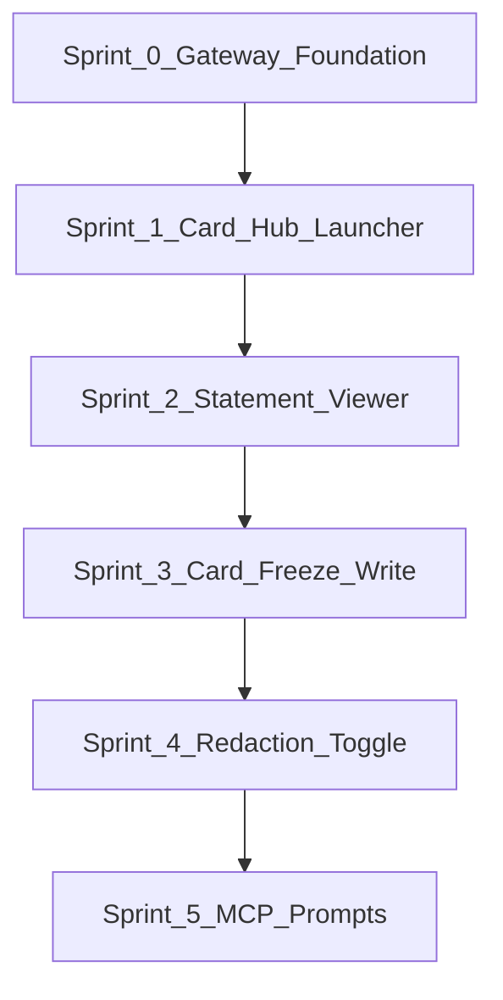

# Local Proof-of-Concept Build Guide

**Audience:** Engineers implementing the Blackwell Bank local concept demo.  
**Strategy:** Prove [`task.md`](task.md) Card Hub composability, gateway semantics, and read/write servicing patterns on `http://localhost:3001/mcp` — no GCP, Cloudflare tunnel, OAuth, or Pub/Sub.

This guide translates the enhancement roadmap in [`report.md`](report.md) into a sequenced build plan. For gap analysis and architectural rationale, read the report first. For production targets, see task.md — they are intentionally **out of scope** here.

---

## What we are proving

The local POC is complete when all five behaviours pass on a laptop:

| ID | Behaviour | Done when |
|---|---|---|
| **L1** | Card Hub composes domains | Hub tile opens a nested fragment; existing acquisition lives under Products Hub |
| **L2** | Read servicing, no step-up | Statement viewer renders synthetic transactions on localhost |
| **L3** | Write + iframe idempotency | Duplicate freeze click returns the same audit receipt, not a second write |
| **L4** | Gateway trace visible | Architecture drawer shows a correlation ID for every tool call |
| **L5** | Model sees less than customer | Redaction toggle contrasts full UI data vs `updateModelContext` payload |

---

## Build order

[`report.md`](report.md) lists Tier 1 enhancements as items 1–6. **Build in sprint order below** to minimise rework: gateway first, then features that plug into it, then UI polish.



| Sprint | Build | report.md ref | Primary files |
|---|---|---|---|
| **0** | In-process gateway: correlation IDs, audit log, redaction helpers | Tier 1 #4 | New [`src/gateway.js`](src/gateway.js); wrap handlers in [`src/server.js`](src/server.js) |
| **1** | Card Hub launcher + hub tiles | Tier 1 #1 | [`src/demo-data.js`](src/demo-data.js), [`src/mcp-app.js`](src/mcp-app.js), [`src/mcp-app.html`](src/mcp-app.html), [`src/mcp-app.css`](src/mcp-app.css) |
| **2** | Statement viewer (read-only servicing) | Tier 1 #2 | [`src/demo-data.js`](src/demo-data.js), server + client |
| **3** | Card freeze/unfreeze with step-up + idempotency | Tier 1 #3 | gateway idempotency store, client modal, `freeze` mode |
| **4** | Architecture trace drawer + redaction toggle | Tier 1 #5 + L4 | [`src/mcp-app.js`](src/mcp-app.js), gateway redaction |
| **5** | MCP prompts registration | Tier 1 #6 | [`src/server.js`](src/server.js) |

**Why gateway first:** Every tool call from Sprint 1 onward should emit correlation IDs and audit entries. Redaction toggle in Sprint 4 needs real eligibility and statement paths to contrast against.

**Estimated effort:** ~10–14 dev days for one engineer familiar with the codebase.

| Sprint | Effort |
|---|---|
| 0 — Gateway | 2 days |
| 1 — Hub launcher | 2–3 days |
| 2 — Statement viewer | 2 days |
| 3 — Card freeze | 2–3 days |
| 4 — Trace + redaction UI | 1–2 days |
| 5 — MCP prompts | 1 day |

---

## Sprint 0 — Gateway foundation

**Goal:** Simulate the MCP Gateway in-process so all tool handlers share correlation IDs, audit logging, and redaction helpers.

### New module: `src/gateway.js`

Implement:

- `withGateway(toolId, handler, descriptor)` — wraps each tool handler
- `redactForModel(payload)` — bucket credit limits, tokenise merchant strings, strip vulnerability flags
- `appendAuditEvent(event)` — push to in-memory `auditLog[]`
- `checkIdempotency(key, fingerprint)` / `storeIdempotency(key, response)` — `Map` with configurable TTL (default 24h)
- `getAuditLog()` — for UI trace drawer (Sprint 4)

**Descriptor shape** (per tool):

```javascript
{
  fragmentId: "card.freeze",      // task.md fragment ID
  domain: "card-controls",        // hub domain
  authPosture: "anonymous",       // "anonymous" | "read" | "step-up"
  visibility: "model",            // "model" | "app"
}
```

**Handler wrapper behaviour:**

1. Generate `correlationId` via `crypto.randomUUID()`
2. If write tool and `idempotencyKey` present, check store — return cached response on duplicate
3. Call handler with `{ correlationId, ...ctx }`
4. Append audit event: `{ correlationId, toolId, fragmentId, timestamp, outcome }`
5. Attach `_audit: { correlationId, toolId, timestamp }` to `structuredContent`

Optional: persist `demo-audit/events.json` on each append (add `demo-audit/` to [`.gitignore`](.gitignore)).

### Changes to `src/server.js`

Wrap **all existing** tool handlers with `withGateway` before registering new tools. No change to tool names or Zod schemas in this sprint.

### Tests: `test/gateway.test.js`

- `withGateway` attaches `_audit.correlationId` to structured content
- `redactForModel` buckets `£4,000` credit limit into a range string
- `redactForModel` replaces merchant names with `MERCHANT_TOKEN_*`
- Idempotency: same key within TTL returns identical response object
- Idempotency: expired key allows new write

### Local verification

```bash
npm run build && npm start
npm test
```

Call any existing tool via basic-host or curl — inspect `structuredContent._audit` in the tool result.

### Definition of done

- [ ] `src/gateway.js` exists and exports `withGateway`, `redactForModel`, `getAuditLog`
- [ ] All six existing tools wrapped in gateway
- [ ] `npm test` passes including `test/gateway.test.js`
- [ ] Tool results include `_audit.correlationId`

---

## Sprint 1 — Card Hub launcher

**Goal:** Replace the monolithic sales entry point with a composable Card Hub tile launcher (task.md v1.2).

**Proves:** L1

### New tool

| Tool | Visibility | Input | Returns |
|---|---|---|---|
| `blackwell-open-hub` | model | _(none)_ | `kind: "card-hub"`, `mode: "hub"`, `tiles[]` |

### App-only tool (optional)

| Tool | Visibility | Input | Returns |
|---|---|---|---|
| `blackwell-navigate-hub` | app | `hubId: string` | Routes to target tool/mode without LLM |

### Data: `getHubPayload()` in `src/demo-data.js`

```javascript
{
  kind: "card-hub",
  mode: "hub",
  brand: BRAND,
  tiles: [
    { id: "products",      label: "Products",       status: "live",  targetTool: "blackwell-browse-cards" },
    { id: "statements",    label: "Statements",     status: "live",  targetTool: "blackwell-view-statement" },  // Sprint 2
    { id: "card-controls", label: "Card Controls",  status: "live",  targetTool: "blackwell-freeze-card" },     // Sprint 3
    { id: "spend",         label: "Spend Insights", status: "stub" },
    { id: "travel",        label: "Travel",         status: "stub" },
    { id: "disputes",      label: "Disputes",       status: "stub" },
    { id: "offers",        label: "Merchant Offers",status: "stub" },
  ],
}
```

Stub tiles render disabled with "Coming soon" — proves platform shape without building every hub.

### UI changes

- Add `view-hub` container in [`src/mcp-app.html`](src/mcp-app.html)
- `renderHub()` in [`src/mcp-app.js`](src/mcp-app.js): tile grid, click handler
- Live tile: call target tool via `app.callServerTool`, then `handleToolResult`
- Stub tile: no-op or tooltip
- Hub tile styles in [`src/mcp-app.css`](src/mcp-app.css)

### Bootstrap change

On `app.connect()`, call `blackwell-open-hub` instead of `blackwell-browse-cards`. Optional env override: `DEMO_ENTRY=catalogue` restores old behaviour for regression testing.

### Gateway

Register `blackwell-open-hub` through `withGateway` with `fragmentId: "card-hub"`, `domain: "platform"`, `authPosture: "anonymous"`.

### Tests

- `getHubPayload()` returns 7 tiles, 3 live + 4 stub
- Live tiles reference valid tool names

### Local verification

Prompt in basic-host or Claude Desktop:

> Open my Blackwell Card Hub

Click **Products** — existing full acquisition UI loads. Stub tiles show "Coming soon".

### Definition of done

- [ ] `blackwell-open-hub` tool registered and gateway-wrapped
- [ ] Hub view renders on connect (default entry)
- [ ] Products tile opens existing `full` mode
- [ ] Stub tiles visible but non-interactive
- [ ] Existing `blackwell-browse-cards` still works when called directly

---

## Sprint 2 — Statement viewer

**Goal:** Add read-only servicing — statement and transactions without step-up (task.md §12.1).

**Proves:** L2

### New tools

| Tool | Visibility | Input | Returns |
|---|---|---|---|
| `blackwell-view-statement` | model | `period?: string` | `kind: "statement"`, `mode: "statement"`, statement summary |
| `blackwell-list-transactions` | app | `page?: number` | Paginated transaction list |

### Data additions in `src/demo-data.js`

- `getStatement({ period })` — opening balance, closing balance, period label, card last-four (`•••• 4321`)
- `getTransactions({ page, pageSize })` — 8–10 synthetic UK transactions per page
- Each transaction: `id`, `date`, `merchantDisplay` (UI only), `merchantToken` (model-visible, e.g. `MERCHANT_TOKEN_A1B2`), `amount`, `category`
- `toStatementModelContext(statement)` — redacted summary for `updateModelContext`

### UI: `mode: "statement"`

- Statement header: period, balances
- Transaction list with merchant display names (full text — customer view)
- Pagination controls call `blackwell-list-transactions` (app-only)
- After load, `updateModelContext` with `redactForModel(toStatementModelContext(...))` — merchant tokens only, amounts bucketed if above threshold

### Gateway

- `blackwell-view-statement`: `fragmentId: "statement.viewer"`, `authPosture: "read"`
- `blackwell-list-transactions`: `fragmentId: "txn.list"`, visibility app

### Tests

- `getStatement()` returns expected period and balances
- `getTransactions({ page: 1 })` returns `pageSize` items
- `toStatementModelContext` uses merchant tokens, not display names

### Local verification

> Open my Blackwell Card Hub

Click **Statements**, or prompt:

> Show my latest credit card statement

Paginate transactions. Confirm model context (if visible in host) uses tokens not merchant names.

### Definition of done

- [ ] Statement view renders synthetic data on localhost
- [ ] Pagination works via app-only tool
- [ ] `updateModelContext` uses redacted payload
- [ ] Statements Hub tile from Sprint 1 navigates here
- [ ] No step-up modal shown

---

## Sprint 3 — Card freeze / unfreeze

**Goal:** Demonstrate low-risk write with iframe-owned idempotency and simulated step-up (task.md §12.2, §9.3, §15).

**Proves:** L3

### New tools

| Tool | Visibility | Input | Returns |
|---|---|---|---|
| `blackwell-freeze-card` | model | _(none)_ | `mode: "freeze"`, current card status |
| `blackwell-unfreeze-card` | model | _(none)_ | Same view, unfreeze CTA prominent |
| `blackwell-confirm-freeze` | app | `idempotencyKey`, `scaVerified: boolean`, `action: "freeze" \| "unfreeze"` | Audit receipt + updated status |
| `blackwell-confirm-unfreeze` | app | same shape | Audit receipt + updated status |

Consolidate confirm tools into one `blackwell-confirm-card-control` if preferred — keep app-only visibility.

### Data additions

- `getCardStatus()` — `{ frozen: boolean, lastFour: "4321", network: "VISA" }`
- `applyCardControl({ action, idempotencyKey })` — toggles in-memory state; returns receipt payload

### UI: `mode: "freeze"`

- Card status panel (active / frozen badge)
- **Freeze card** / **Unfreeze card** buttons
- Step-up modal on confirm:
  - Copy: "Verify with passkey to continue"
  - Button: **Verify with passkey** (fake WebAuthn — no real credential)
  - On verify: generate `idempotencyKey = crypto.randomUUID()` **in iframe**, call confirm tool
- **Audit receipt** panel after success: `correlationId`, `toolId`, `fragmentId`, `idempotencyKey`, `outcome`, `timestamp`
- Click freeze again with same key path → gateway returns cached receipt (idempotent replay)

### Gateway idempotency

In `withGateway`, for write tools (`authPosture: "step-up"`):

1. Read `args.idempotencyKey`
2. If key exists in store, return stored response without calling handler
3. Otherwise execute handler and store response with TTL

### Consumer Duty

Unfreeze button equally visible when card is frozen. Do not strand the customer in frozen state without a clear unfreeze path.

### Tests

- `applyCardControl({ action: "freeze" })` sets `frozen: true`
- Gateway idempotency: second call with same key returns same `correlationId` and outcome
- Confirm tool rejects `scaVerified: false`

### Local verification

> Open my Blackwell Card Hub

Click **Card Controls**, or prompt:

> Freeze my credit card

Complete fake step-up. Note audit receipt. Click freeze again — same receipt, no duplicate event in audit log.

Then:

> Unfreeze my card

### Definition of done

- [ ] Freeze and unfreeze both work locally
- [ ] Idempotency key generated in iframe, never accepted from model-visible tool args
- [ ] Duplicate confirm returns cached response
- [ ] Audit receipt visible in UI
- [ ] Card Controls Hub tile navigates here

---

## Sprint 4 — Architecture trace drawer + redaction toggle

**Goal:** Make gateway behaviour visible to architects; prove model receives less than the customer sees (task.md §7.3, §9.1).

**Proves:** L4, L5

### Architecture trace drawer

- Slide-out or fixed panel toggled by button in app chrome (e.g. "Architecture trace")
- Lists `getAuditLog()` entries newest-first: timestamp, toolId, correlationId, fragmentId, outcome
- Each entry expandable to show full audit payload
- Label production gap inline: *"Production: persisted to Pub/Sub"*

Fetch audit log via app-only tool `blackwell-get-audit-log` (visibility app) or embed last N events in every gateway response `_audit.recentEvents`.

### Redaction toggle

- Toggle: **Customer view** / **Model view**
- After eligibility check or statement load, show side-by-side (or switch):
  - Customer: full credit limit, merchant names, amounts
  - Model: bucketed limit, `MERCHANT_TOKEN_*`, redacted summary text
- Display the exact string that would be sent to `updateModelContext`

### Fix existing eligibility path

In [`src/mcp-app.js`](src/mcp-app.js), eligibility form submit (~line 473): route `updateModelContext` text through `redactForModel()` — either import from a shared module exposed to client via tool result metadata, or add app-only `blackwell-get-redacted-context` that returns the redacted string server-side.

**Recommended:** server returns `modelContextText` in eligibility tool result (gateway-redacted); client passes it to `updateModelContext` unchanged.

### Tests

- Audit log accumulates entries across multiple tool calls
- Eligibility `structuredContent` includes `modelContextText` with bucketed credit limit
- Redaction toggle shows different content in each mode

### Local verification

1. Run eligibility check → flip redaction toggle → confirm model view hides exact limit
2. Open Architecture trace → confirm correlation IDs match `_audit` on tool results
3. Freeze card → new entry appears in trace

### Definition of done

- [ ] Trace drawer lists all tool calls from session
- [ ] Redaction toggle works for eligibility and statement
- [ ] `updateModelContext` no longer sends raw credit limit or merchant names
- [ ] L4 and L5 acceptance criteria pass

---

## Sprint 5 — MCP prompts

**Goal:** Complete the four MCP capability types from task.md §3.1 (tools, resources, prompts, UI).

### Register prompts on `McpServer`

| Prompt | Purpose | Arguments |
|---|---|---|
| `servicing-triage` | Colleague opening checklist for inbound contact | `customerId`, `channel`, `intent` |
| `card-recommendation-brief` | Structured brief before card catalogue | `need`, `creditBand`, `existingCustomer` |

Use MCP SDK `server.registerPrompt()` with Zod argument schemas matching existing enums in [`src/demo-data.js`](src/demo-data.js).

**Defer to Tier 2:** `policy-lookup`, `response-draft` (agent assist — see [`report.md`](report.md) Tier 2 #9).

### Local verification

In a host that supports prompts, invoke `card-recommendation-brief` with `need: "travel"`, then ask the model to browse cards — confirm structured brief precedes tool call.

### Definition of done

- [ ] Both prompts appear in `prompts/list` response
- [ ] Prompt templates reference Blackwell Bank terminology
- [ ] No new UI required for this sprint

---

## Local dev workflow

### Setup (once)

```bash
npm run setup
```

### Primary development loop

```bash
npm run dev
```

Rebuilds UI on change and restarts the server. MCP endpoint: `http://localhost:3001/mcp`.

### Test after every sprint

```bash
npm test
```

### AI hosts (no tunnel required)

| Client | How | Best for |
|---|---|---|
| [basic-host](https://github.com/modelcontextprotocol/ext-apps/tree/main/examples/basic-host) | Point at `http://localhost:3001/mcp` | Fastest UI iteration |
| Claude Desktop | `npm run start:stdio` | Real LLM tool selection |
| curl | JSON-RPC to `/mcp` | Smoke testing tool registration |

### Smoke test — list tools

```bash
curl -s http://localhost:3001/mcp \
  -H "Content-Type: application/json" \
  -H "Accept: application/json, text/event-stream" \
  -d '{"jsonrpc":"2.0","method":"tools/list","params":{},"id":2}' \
  | grep '^data:' | cut -c7- | node -e "process.stdin.setEncoding('utf8');let d='';process.stdin.on('data',c=>d+=c);process.stdin.on('end',()=>JSON.parse(d).result?.tools?.forEach(t=>console.log(t.name)))"
```

Expected tool count after each sprint:

| After sprint | Approx. model-visible tools | App-only tools |
|---|---|---|
| 0 | 4 (unchanged) | 2 |
| 1 | 5 (+hub) | 2–3 |
| 2 | 6 (+statement) | 3–4 |
| 3 | 7–8 (+freeze/unfreeze) | 4–5 |
| 4 | unchanged | +audit/redaction |
| 5 | unchanged | unchanged |

---

## Local demo walkthroughs

Run on localhost with basic-host or Claude Desktop before any hosted demo.

### Walkthrough A — Hub → statement (read)

| Step | Action | Expected |
|---|---|---|
| 1 | *"Open my Blackwell Card Hub"* | Hub tiles render |
| 2 | Click **Statements** | Statement viewer with synthetic data |
| 3 | Paginate transactions | App-only tool updates list; model not involved |
| 4 | Open Architecture trace | Correlation IDs on statement + list calls |
| 5 | Toggle Model view | Merchant tokens, bucketed amounts |

### Walkthrough B — Hub → freeze → idempotent replay (write)

| Step | Action | Expected |
|---|---|---|
| 1 | *"Open my Blackwell Card Hub"* | Hub tiles render |
| 2 | Click **Card Controls** | Freeze fragment with card status |
| 3 | Click **Freeze card** | Step-up modal appears |
| 4 | **Verify with passkey** | Audit receipt with correlationId + idempotencyKey |
| 5 | Click **Freeze card** again | Same receipt — idempotent replay |
| 6 | *"Unfreeze my card"* | Unfreeze flow completes equally easily |

### Walkthrough C — Products hub (regression)

| Step | Action | Expected |
|---|---|---|
| 1 | Click **Products** on hub | Existing full acquisition UI |
| 2 | Complete eligibility + apply | Existing flows unchanged |

**Not in this POC:** Agent assist colleague summary (Tier 2). See [`report.md`](report.md) Journey C.

---

## PROMPTS.md additions

Add these sections to [`PROMPTS.md`](PROMPTS.md) as each sprint ships:

### Hub launcher (Sprint 1)

> Open my Blackwell Card Hub

> Show me the Blackwell Bank card hub

### Statement viewer (Sprint 2)

> Show my latest credit card statement

> What transactions are on my Blackwell card this month?

### Card controls (Sprint 3)

> Freeze my credit card

> I think my card was stolen — freeze it

> Unfreeze my Blackwell card

### Multi-turn: hub to servicing (Sprint 2+)

> Open my Blackwell Card Hub

*(click Statements)*

> What's my biggest spend this month?

### Multi-turn: hub to freeze (Sprint 3+)

> Open my Blackwell Card Hub

*(click Card Controls → freeze → verify)*

> Is my card frozen now?

---

## Explicitly out of scope

Do **not** build these in the local POC phase:

- Cloudflare tunnel / changes to `npm run start:cloud`
- Real OAuth, MCP Authorization spec, or WebAuthn credentials
- Signed `fragments/manifest.json` catalogue (Tier 2)
- Disputes wizard, agent assist panel, vulnerability routing (Tier 2)
- Firestore idempotency, Pub/Sub audit, Apigee X, GKE gateway (Tier 3)
- OpenTelemetry export to Cloud Monitoring (Tier 3)
- Separate Vite bundle per hub domain (Tier 3)
- Real customer data, PAN, or production API integrations

### Later (after local POC passes)

| Phase | What | When |
|---|---|---|
| Phase 2 — Hosted demo | `npm run start:cloud`, ChatGPT/Claude web, executive prompts | After L1–L5 checklist complete |
| Tier 2 | Manifests, disputes, agent assist, degradation flag | After hosted demo feedback |
| Tier 3 | Production gateway, OAuth, GCP estate | Governance-approved programme |

---

## Definition of done — whole local POC

Before promoting to Phase 2 (hosted demo):

- [ ] **L1** — Hub launcher composes domains; Products tile opens acquisition
- [ ] **L2** — Statement viewer works with synthetic data, no step-up
- [ ] **L3** — Freeze idempotency proven with duplicate click test
- [ ] **L4** — Architecture trace shows correlation ID per tool call
- [ ] **L5** — Redaction toggle shows model receives less than customer
- [ ] `npm test` green, including `test/gateway.test.js`
- [ ] Existing acquisition flows work (browse, eligibility, apply, app-only tools)
- [ ] [`PROMPTS.md`](PROMPTS.md) updated with hub, statement, and freeze prompts
- [ ] No production secrets or real customer data in repo
- [ ] `demo-audit/` gitignored if file persistence enabled

---

## File touchpoint summary

| Concern | File(s) |
|---|---|
| Gateway simulation | `src/gateway.js` (new) |
| Tool registration | [`src/server.js`](src/server.js) |
| Synthetic data | [`src/demo-data.js`](src/demo-data.js) |
| Client app | [`src/mcp-app.js`](src/mcp-app.js), [`src/mcp-app.html`](src/mcp-app.html), [`src/mcp-app.css`](src/mcp-app.css) |
| Tests | [`test/demo-data.test.js`](test/demo-data.test.js), `test/gateway.test.js` (new) |
| Demo prompts | [`PROMPTS.md`](PROMPTS.md) |
| Transport | [`src/index.js`](src/index.js) — no changes expected |
| Architecture rationale | [`report.md`](report.md) |
| Production target | [`task.md`](task.md) |

---

## What this document is not

- Not a duplicate of [`report.md`](report.md) — read that for gap analysis and stakeholder narrative
- Not a production deployment or GCP mapping guide
- Not a Tier 2/3 backlog — those are named only under "Later" and "Out of scope"
