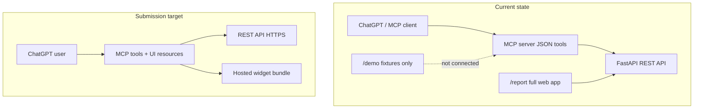

# MyAreaReport — Submission Readiness Review

**Date:** 2026-05-18  
**Scope:** ChatGPT Apps SDK submission + Codex plugin packaging  
**Repo:** `myareareport/`

This document audits the codebase against OpenAI’s submission-oriented guidance. Use it as the single checklist before submitting to ChatGPT or packaging a Codex plugin.

---

## Executive summary

MyAreaReport has a **solid backend and generic MCP layer** but is **not yet submission-ready** for ChatGPT Apps or Codex plugin distribution.

| Track | Readiness | Notes |
|-------|-----------|-------|
| **REST API + data compliance** | ~85% | Deterministic summaries, caveats, legal pages, tests |
| **Generic MCP tools** | ~70% | Five tools, structured errors, tests; short docstrings; SSE only |
| **ChatGPT in-chat experience** | ~15% | UI fragments exist as design prototypes only; no connector/widgets |
| **Codex plugin packaging** | ~0% | No manifest, marketplace, assets, or bundled `.mcp.json` / `.app.json` |

**Bottom line:** Submitting today would fail on **in-chat completion** (no embedded UI wired to tools), **public production MCP**, and **app/connector manifests**. The web report at `/report/[postcode]` is appropriate as a standalone product but must **not** be the primary ChatGPT surface.

### Reference documentation

| Guide | URL |
|-------|-----|
| Build plugins (Codex) | https://developers.openai.com/codex/plugins/build |
| UX principles (Apps SDK) | https://developers.openai.com/apps-sdk/concepts/ux-principles |
| UI guidelines (Apps SDK) | https://developers.openai.com/apps-sdk/concepts/ui-guidelines |

Related project docs:

- [submission-checklist.md](./submission-checklist.md) — web/legal/infra (generic)
- [app-metadata-draft.md](./app-metadata-draft.md) — name, descriptions, caveats
- [screenshot-checklist.md](./screenshot-checklist.md) — web screenshots
- [mcp-usage.md](./mcp-usage.md) — MCP run/connect (needs example fix; see §8)
- [demo-script.md](./demo-script.md) — reviewer walkthrough (web-focused)
- [deployment-checklist.md](./deployment-checklist.md) — production deploy (no MCP items)

---

## What is already strong

### Atomic MCP tools

Five focused tools in `apps/mcp/server.py`, each proxying the REST API:

| Tool | File | Purpose |
|------|------|---------|
| `get_area_summary` | `apps/mcp/tools/area_summary.py` | Postcode → area metadata |
| `get_crime_stats` | `apps/mcp/tools/crime_stats.py` | Reported crime summary |
| `get_flood_risk` | `apps/mcp/tools/flood_risk.py` | Warnings + stations |
| `get_planning_activity` | `apps/mcp/tools/planning_activity.py` | Nearby applications |
| `compare_areas` | `apps/mcp/tools/compare_areas.py` | Side-by-side two postcodes |

All return structured `dict` JSON with `error` / `retryable` on failure (see `docs/mcp-usage.md`).

### Compliance-minded content

- **Crime summaries:** Rule-based, no ranking/safety labels (`apps/api/app/summaries/crime_summary.py`).
- **Banned wording tests:** `apps/api/tests/test_summaries.py` rejects `safe`, `unsafe`, `dangerous`, etc.
- **Caveats** in API responses and tool outputs (e.g. `compare_areas` caveats in `apps/mcp/tools/compare_areas.py`).
- **Legal pages:** `apps/web/app/privacy/page.tsx`, `terms/page.tsx`, `data-sources/page.tsx`.
- **Metadata draft** with required caveat text: `docs/app-metadata-draft.md`.

### UI fragment prototypes (ChatGPT-shaped)

Compact inline-style cards under `apps/web/components/fragments/`:

- `InlineAreaSummary.tsx`
- `CrimeTrendFragment.tsx`
- `FloodRiskFragment.tsx`
- `PlanningApplicationsFragment.tsx`
- `AreaComparisonFragment.tsx`

Demo page: `apps/web/app/demo/page.tsx` (fixture data from `apps/web/lib/fixtures.ts`).

### Tests and infra

- MCP tool tests: `apps/mcp/tests/test_tools.py`
- Docker Compose includes `mcp` service (SSE on port 8001): `infra/docker-compose.yml`
- API + web behind Caddy: `infra/Caddyfile`

---

## Architecture: today vs target



---

## Blockers (must fix before submission)

Severity: **P0** = blocks review; fix before submit.

| ID | Severity | Issue | Evidence | Recommendation |
|----|----------|-------|----------|----------------|
| B1 | P0 | **No ChatGPT connector / app manifest** | No `.app.json`, OAuth, or registered app | Add `.app.json`; register connector per Apps SDK deploy docs; map tools to app |
| B2 | P0 | **Tools not bound to UI** | MCP returns JSON only; fragments use fixtures on `/demo` | Register MCP UI resources/templates per tool; build widget bundle with **live** API data |
| B3 | P0 | **MCP not on public HTTPS** | `infra/Caddyfile` proxies `/api` + web only; MCP on `:8001` | Expose MCP via Caddy (or dedicated host) with TLS; document production URL |
| B4 | P0 | **Cannot complete task in-chat** | No embedded widgets in ChatGPT | End-to-end test: postcode → inline card(s) without leaving ChatGPT |
| B5 | P0 | **Production legal URLs** | Privacy/terms exist locally only | Deploy web; use HTTPS URLs in app + plugin `interface` metadata |
| B6 | P1 | **Transport may not match ChatGPT production** | `MCP_TRANSPORT=sse` in `infra/docker-compose.yml`, `apps/mcp/server.py` | Confirm streamable HTTP requirement; upgrade FastMCP transport if required |
| B7 | P1 | **No Codex plugin manifest** | Missing `.codex-plugin/plugin.json` | Scaffold plugin (see §7) if distributing via Codex marketplace |

---

## Recommendations by priority

### High

| # | Item | Files / actions |
|---|------|-----------------|
| H1 | **Wire each tool to one inline widget** | Map `get_area_summary` → `InlineAreaSummary`, `get_crime_stats` → `CrimeTrendFragment`, etc.; follow Apps SDK “Build your ChatGPT UI” |
| H2 | **Replace fixture demo with live data path** | `apps/web/app/demo/page.tsx`, `apps/web/lib/fixtures.ts` — widgets must consume tool/API payloads |
| H3 | **Enrich tool metadata for the model** | `apps/mcp/server.py` — expand docstrings; add parameter descriptions (UK postcode format, defaults, when to use each tool) |
| H4 | **Add follow-up hints in tool responses** | e.g. `"suggested_followups": ["Compare with another postcode", "Show flood risk"]` in JSON (model-friendly, keeps chat in flow) |
| H5 | **Public HTTPS for API + MCP + web** | `infra/Caddyfile`, `infra/deployment-checklist.md` — add MCP smoke tests |
| H6 | **ChatGPT-specific screenshots** | Extend `docs/screenshot-checklist.md` — inline cards inside ChatGPT, not only `/demo` |
| H7 | **ChatGPT demo script** | New doc or extend `docs/demo-script.md` — prompts that trigger tools + widgets (avoid leading reviewers to full `/report` as primary demo) |
| H8 | **Fix misleading MCP doc example** | `docs/mcp-usage.md` lines ~245–246 use `"High crime levels ..."` — replace with neutral summary matching `crime_summary.py` |

### Medium

| # | Item | Files / actions |
|---|------|-----------------|
| M1 | **Adopt Apps SDK UI design system** | `apps/web/package.json` — add `@openai/apps-sdk-ui` (or equivalent); replace hardcoded grays in fragments |
| M2 | **Scaffold Codex plugin** | `plugins/myareareport/.codex-plugin/plugin.json`, `.mcp.json`, `.app.json`, `skills/`, `assets/` |
| M3 | **Marketplace entry** | `.agents/plugins/marketplace.json` with `policy.installation`, `policy.authentication`, `category` |
| M4 | **Map app-metadata-draft → manifest `interface`** | `docs/app-metadata-draft.md` → `privacyPolicyURL`, `termsOfServiceURL`, `defaultPrompt`, descriptions |
| M5 | **Plugin assets** | `assets/icon.png`, `logo.png`, screenshots for install surface |
| M6 | **Performance budget for `compare_areas`** | `apps/mcp/tools/compare_areas.py` — 30s timeout; aim &lt;3s p95 for chat rhythm; consider slimmer endpoint |
| M7 | **Planning: consider inline carousel** | `PlanningApplicationsFragment.tsx` — UI guidelines suggest 3–8 items with image/metadata for carousels when in ChatGPT |
| M8 | **External link in flood fragment** | `FloodRiskFragment.tsx` — `View official flood warnings` opens new tab; ensure acceptable for inline card or move to conversation |

### Low

| # | Item | Files / actions |
|---|------|-----------------|
| L1 | **Typography in embedded mode** | `InlineAreaSummary.tsx` — `text-2xl` may exceed body-scale preference; tune when using system tokens |
| L2 | **Map in ChatGPT** | `ReportMap.tsx`, report page — use **fullscreen** display mode if map is offered; not inline nested scroll |
| L3 | **Accessibility pass** | Fragments + map — `alt` text, contrast, resize; loading state already has `aria-label` in `report/.../loading.tsx` |
| L4 | **Merge submission checklists** | Optionally fold Apps SDK rows from this file into `submission-checklist.md` later |
| L5 | **Onboarding skill** | `plugins/.../skills/` — “How to ask for UK area reports in ChatGPT” |

---

## UX principles checklist

Source: [UX principles — checklist before publishing](https://developers.openai.com/apps-sdk/concepts/ux-principles#checklist-before-publishing)

| Question | Status | Notes |
|----------|--------|-------|
| **Conversational value** — primary capability uses NL, context, multi-turn? | **Partial** | Tools fit conversation; no ChatGPT-specific onboarding or context use yet |
| **Beyond base ChatGPT** — new knowledge/actions/presentation? | **Yes** | Aggregated UK public data (crime, flood, planning) not available in base model |
| **Atomic, model-friendly actions** — indivisible tools, explicit I/O? | **Mostly yes** | Five tools are clear; `compare_areas` fetches full report twice (heavier but explicit params) |
| **Helpful UI only** — would plain text degrade UX? | **Yes (potential)** | Fragments add structure; **not wired** so benefit unrealized in ChatGPT today |
| **End-to-end in-chat completion** — finish task without leaving? | **No** | Blocker B4 |
| **Performance & responsiveness** — maintains chat rhythm? | **Unknown** | Measure `compare_areas` and cold API paths in production |
| **Discoverability** — easy prompts to select app? | **Partial** | Short tool names OK; descriptions need examples (“crime in SW1A 1AA”, “compare CH1 4AB and M1 1AE”) |
| **Platform fit** — rich prompts, context, composition, multimodality? | **Low** | No memory/composition story documented |

### UX principles — design rules

| Principle | Status | Recommendation |
|-----------|--------|----------------|
| 1. Extract, don’t port | **Pass (tools)** / **Risk (web)** | Do not submit full `/report` dashboard as the ChatGPT experience |
| 2. Design for conversational entry | **Partial** | Add `defaultPrompt` in plugin manifest; skill for fuzzy vs direct postcode queries |
| 3. Design for ChatGPT environment | **Fail** | Use conversation for history/confirm; UI for structured results only |
| 4. Optimize for conversation, not navigation | **Partial** | JSON is concise; add follow-up suggestions (H4) |
| 5. Embrace ecosystem moment | **Partial** | NL postcodes work; no composition with other apps documented |

### Avoid (UX anti-patterns)

| Anti-pattern | Status |
|--------------|--------|
| Long-form / static website content in app | **Risk** — full report page is long-form; keep out of ChatGPT inline |
| Complex multi-step workflows in inline/fullscreen | **OK** — tools are single-step |
| Ads, upsells, irrelevant messaging | **Pass** |
| Sensitive/private info in shared cards | **Caution** — postcodes visible in shared chats; minimize extra PII |
| Duplicating ChatGPT composer | **Pass** |

---

## UI guidelines checklist

Source: [UI guidelines](https://developers.openai.com/apps-sdk/concepts/ui-guidelines)

### Display modes

| Mode | Appropriate for MyAreaReport? | Current state |
|------|--------------------------------|---------------|
| **Inline card** | Yes — summary, crime, flood, planning, comparison | Fragments match ~480px card pattern; not embedded in ChatGPT |
| **Inline carousel** | Optional — multiple planning applications | Static list of 3 in `PlanningApplicationsFragment.tsx`; consider 3–8 item carousel |
| **Fullscreen** | Yes — map exploration | Map only on web report (`MapWrapper` / `ReportMap.tsx`); not integrated |
| **Picture-in-picture** | No | N/A |

### Inline card rules

| Rule | Compliant? | Location / note |
|------|------------|---------------|
| Max two primary actions per card | **Yes** (0 actions) | OK if model drives next tool via chat |
| No deep navigation / tabs in card | **Yes** | Fragments are single-view |
| No nested scrolling | **Yes** | Short lists only |
| No duplicative inputs (no fake composer) | **Yes** | |
| Title when document-based | **Partial** | Section labels (`Crime`, `Flood`) not card titles |
| Expand → fullscreen for rich media | **N/A** | No expand control; add if map embedded |

### Visual design

| Rule | Compliant? | Location / note |
|------|------------|---------------|
| System colors for text/icons/dividers | **No** | `bg-white`, `border-gray-200`, `text-gray-*`, `text-blue-600` throughout fragments |
| Partner brand on accents only | **N/A** | No logo in widgets (correct) |
| No custom fonts | **Partial** | Tailwind defaults; adopt system font variables in embed |
| System grid spacing | **Partial** | Consistent `p-4` but not Apps SDK tokens |
| Imagery aspect ratios | **N/A** | No images in fragments yet |
| WCAG AA contrast | **Review** | Gray-on-white body text — verify in embed theme |
| Alt text for images | **N/A** | Add if carousel images added |
| Text resize without layout break | **Review** | Test in ChatGPT embed |

### Fragment-specific notes

| Component | Issue |
|-----------|-------|
| `InlineAreaSummary.tsx` | Large postcode (`text-2xl`) — fine for web demo; tune for embedded body scale |
| `FloodRiskFragment.tsx` | External link may pull users out of chat flow (M8) |
| `CrimeTrendFragment.tsx` | `<details>` for caveats — OK; ensure keyboard accessible in embed |
| `AreaComparisonFragment.tsx` | Two-column layout fits inline comparison pattern |

### Screenshots (UI guidelines + project)

From `docs/screenshot-checklist.md` — **add before submit:**

- [ ] ChatGPT inline — area summary after tool call
- [ ] ChatGPT inline — crime / flood / planning cards
- [ ] ChatGPT inline — compare two postcodes
- [ ] ChatGPT fullscreen — map (if shipped)
- [ ] Error state — invalid postcode in chat

Existing web/demo shots remain useful for marketing but **do not substitute** for in-chat captures.

---

## Codex plugin checklist

Source: [Build plugins](https://developers.openai.com/codex/plugins/build)

Note: Official Plugin Directory self-serve publishing is **coming soon** per OpenAI docs; a complete manifest still enables repo/personal marketplace install.

### Required structure

| Path | Required? | Present? |
|------|-----------|----------|
| `.codex-plugin/plugin.json` | Yes | **No** |
| `skills/<name>/SKILL.md` | Optional | **No** |
| `hooks/hooks.json` | Optional | **No** |
| `.mcp.json` | Optional | **No** |
| `.app.json` | Optional | **No** |
| `assets/` (icon, logo, screenshots) | Recommended for publish | **No** |
| `.agents/plugins/marketplace.json` | For repo catalog | **No** |

### Suggested `plugin.json` fields (from app-metadata-draft)

Map content from `docs/app-metadata-draft.md`:

```json
{
  "name": "myareareport",
  "version": "0.1.0",
  "description": "UK area reports using public data: crime, flood, and planning.",
  "license": "MIT",
  "skills": "./skills/",
  "mcpServers": "./.mcp.json",
  "apps": "./.app.json",
  "interface": {
    "displayName": "MyAreaReport",
    "shortDescription": "UK area reports using public data: crime, flood, and planning.",
    "longDescription": "<from app-metadata-draft.md long description + caveat>",
    "developerName": "<your org>",
    "category": "Reference",
    "websiteURL": "https://<production-domain>",
    "privacyPolicyURL": "https://<production-domain>/privacy",
    "termsOfServiceURL": "https://<production-domain>/terms",
    "defaultPrompt": [
      "What is the crime trend for CH1 4AB?",
      "Compare flood risk for SW1A 1AA and YO1 9QN.",
      "Show planning applications near E1 6RF."
    ],
    "composerIcon": "./assets/icon.png",
    "logo": "./assets/logo.png",
    "screenshots": ["./assets/screenshot-inline-1.png"]
  }
}
```

### Marketplace entry template

`.agents/plugins/marketplace.json`:

```json
{
  "name": "myareareport-local",
  "interface": { "displayName": "MyAreaReport (local)" },
  "plugins": [
    {
      "name": "myareareport",
      "source": { "source": "local", "path": "./plugins/myareareport" },
      "policy": {
        "installation": "AVAILABLE",
        "authentication": "ON_INSTALL"
      },
      "category": "Reference"
    }
  ]
}
```

### Path rules (from Codex docs)

- All manifest paths relative to plugin root, prefixed with `./`
- Only `plugin.json` inside `.codex-plugin/`
- Plugin hooks off by default unless `[features].plugin_hooks = true` in user config

---

## ChatGPT Apps SDK — technical checklist

| Item | Status | File(s) |
|------|--------|---------|
| MCP server implements app tools | **Yes** | `apps/mcp/server.py` |
| MCP resources / UI templates | **No** | — |
| Hosted widget bundle URL | **No** | — |
| `.app.json` connector mapping | **No** | — |
| OAuth (if required by connector) | **No** | — |
| Streamable HTTP transport | **Unverified** | SSE: `MCP_TRANSPORT=sse` |
| Public MCP endpoint | **No** | Port 8001 not in Caddy |
| Tool tests | **Yes** | `apps/mcp/tests/test_tools.py` |
| `@openai/apps-sdk` / Apps SDK UI | **No** | `apps/web/package.json` |
| Privacy / terms / data sources live | **Local only** | `apps/web/app/privacy/`, `terms/`, `data-sources/` |

---

## Legal, metadata, and compliance

### Cross-reference: submission-checklist.md

| submission-checklist.md item | Apps SDK / plugin status |
|------------------------------|---------------------------|
| Privacy policy live and linked | **Local pages exist** — need production HTTPS URLs in manifest |
| Terms live and linked | Same |
| Data sources page | Same |
| No unsupported claims | **Aligned** — see app-metadata-draft |
| No safe/unsafe/dangerous language | **API guarded** — fix `mcp-usage.md` example (H8) |
| Screenshots | **Web only** — add ChatGPT captures |
| Postcode search / report (web) | OK for website; not primary ChatGPT demo |
| No PII in Sentry | Verify in production config |
| Deployment checklist | **No MCP items** — add to deployment-checklist.md when MCP is public |

### Cross-reference: app-metadata-draft.md

| Field | Use in submission |
|-------|-------------------|
| Name: MyAreaReport | `interface.displayName` |
| Short description (80 chars) | `shortDescription`, store listing |
| Long description + caveats | `longDescription`, tool preamble, widget footer |
| Category: Reference / Local Information | Marketplace `category` |
| Required caveat text | Visible in widgets + tool `caveats` arrays |
| Data sources list | `/data-sources` page + attribution in fragments |

### Cross-reference: mcp-usage.md — documentation issue

**Issue:** Example output for `compare_areas` includes:

```json
"area_b_summary": "High crime levels ..."
```

This contradicts:

- `docs/submission-checklist.md` — no ranking/safety language
- `apps/api/app/summaries/crime_summary.py` — neutral wording only

**Fix:** Replace with API-style text, e.g. `"Reported crime levels were broadly stable over the selected period."`

Also update `apps/mcp/tests/test_tools.py` if it uses `"High crime."` as fixture summary text for documentation parity (test fixture is OK if it only checks structure, but prefer neutral strings everywhere public-facing).

---

## Tool ↔ UI mapping (recommended)

| MCP tool | Widget component | Display mode |
|----------|------------------|--------------|
| `get_area_summary` | `InlineAreaSummary` | Inline card |
| `get_crime_stats` | `CrimeTrendFragment` | Inline card |
| `get_flood_risk` | `FloodRiskFragment` | Inline card |
| `get_planning_activity` | `PlanningApplicationsFragment` | Inline card or carousel |
| `compare_areas` | `AreaComparisonFragment` | Inline card |

**Do not** surface in ChatGPT inline by default:

- Full report page (`apps/web/app/report/[postcode]/page.tsx`)
- Multi-card scrollable dashboard
- Leaflet map (unless fullscreen with composer)

---

## Implementation roadmap

### Phase 1 — Connector (blockers B1–B5, B6)

1. Deploy API + web to production HTTPS.
2. Expose MCP on public HTTPS (Caddy route or subdomain).
3. Confirm transport (streamable HTTP vs SSE).
4. Create `.app.json` and register ChatGPT connector.
5. Build widget bundle; bind tools to UI resources with **live** data.
6. End-to-end test in ChatGPT Developer Mode.

### Phase 2 — UX polish (H3–H8, M1, M6–M8)

1. Enrich tool descriptions and follow-up hints.
2. Adopt Apps SDK UI tokens/components in fragments.
3. Fix `mcp-usage.md` example wording.
4. Capture ChatGPT inline screenshots; write ChatGPT demo script.
5. Load-test `compare_areas`.

### Phase 3 — Codex plugin (B7, M2–M5)

1. Create `plugins/myareareport/` with full manifest and assets.
2. Add `.agents/plugins/marketplace.json`.
3. Add onboarding skill under `skills/`.
4. Test local install via Codex plugin directory.

### Phase 4 — Pre-submit QA

1. Walk through § UX principles checklist — all “Yes” where required.
2. Walk through § UI guidelines checklist.
3. Walk through `submission-checklist.md` + production URLs.
4. Run `deployment-checklist.md` + MCP smoke tests.
5. Reviewer dry-run using ChatGPT demo script only.

---

## File index (quick reference)

| Area | Path |
|------|------|
| MCP server | `apps/mcp/server.py` |
| MCP tools | `apps/mcp/tools/*.py` |
| MCP tests | `apps/mcp/tests/test_tools.py` |
| UI fragments | `apps/web/components/fragments/*.tsx` |
| Fragment demo | `apps/web/app/demo/page.tsx` |
| Full web report | `apps/web/app/report/[postcode]/page.tsx` |
| Crime summary rules | `apps/api/app/summaries/crime_summary.py` |
| Infra | `infra/docker-compose.yml`, `infra/Caddyfile` |
| Submission docs | `docs/submission-checklist.md`, `docs/app-metadata-draft.md` |

---

## Sign-off checklist (before you submit)

- [ ] All P0 blockers (B1–B5) resolved
- [ ] UX checklist: “End-to-end in-chat completion” = Yes
- [ ] UI checklist: system tokens / embed tested in ChatGPT
- [ ] Production privacy + terms URLs in app and plugin manifest
- [ ] ChatGPT inline screenshots attached
- [ ] `mcp-usage.md` example text neutral (no “high crime” wording)
- [ ] Demo script uses ChatGPT prompts, not only localhost web tour
- [ ] `compare_areas` meets latency target in production
- [ ] Optional: Codex plugin manifest + marketplace for team distribution

---

*This review is based on the repository state and OpenAI documentation as of 2026-05-18. Platform requirements may change; re-verify transport and submission forms at submit time.*
