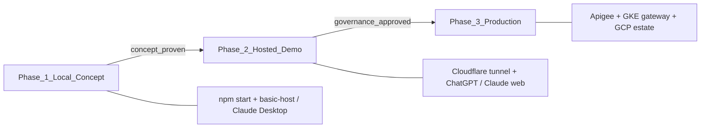
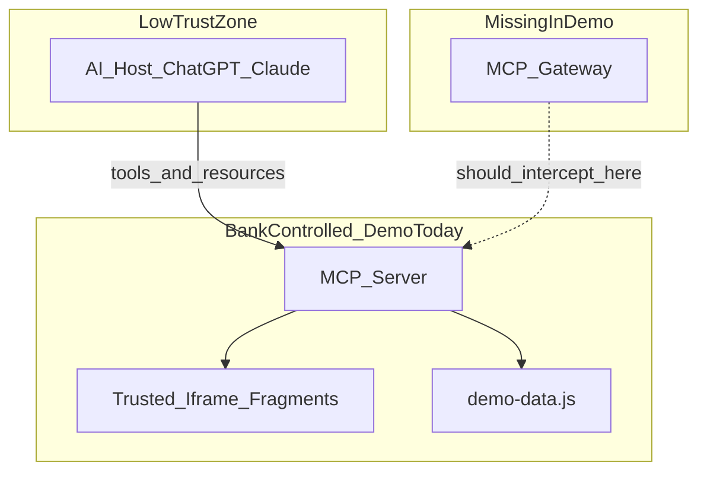
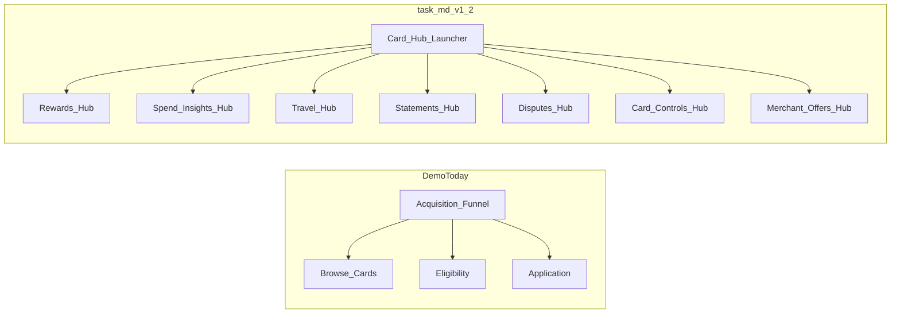

# Blackwell Bank MCP App Demo — Enhancement Report

**Purpose:** Bridge between the architecture paper in [`task.md`](task.md) and this repository.  
**Audience:** Architects, principal engineers, security/compliance leads, and live-demo presenters.  
**Status:** Review draft · 14 May 2026  
**Strategy:** **Local demo first** — prove the concept on a laptop before cloud tunnels, AI hosts, or GCP.

---

## 1. Executive summary

This demo is a **working MCP Apps reference implementation** for a credit card **acquisition** journey: browse cards, check eligibility, and apply. Today it can run entirely on a developer machine via `npm start` at `http://localhost:3001/mcp`, or inside ChatGPT and Claude once exposed through a Cloudflare tunnel. The polished Blackwell Bank UI and SDK integrations already land well on stage.

[`task.md`](task.md) describes something broader: a **production-grade, FCA/PRA-regulated conversational banking platform** built around domain-oriented **Card Hubs**, an **MCP Gateway** trust boundary, trusted UI fragments with signed manifests, OAuth/step-up auth, redaction, idempotency, and immutable audit.

**The recommended path is not to build production infrastructure first.** It is to extend this repo as a **local concept demo** that proves the architecture paper's ideas are technically coherent and visually compelling — then promote the same server to wider audiences only after the concept is validated locally.



**What the demo proves today (locally):** MCP Apps UX patterns, multi-mode trusted fragments, app-only tool visibility, and stdio/HTTP transport on localhost.

**What a local concept demo should prove next:** Card Hub composability, read vs write servicing patterns, simulated gateway/redaction/audit, and the §15 principle — *the iframe renders the button; the bank decides whether the button works* — all without GCP, Apigee, Pub/Sub, or a public URL.

**What remains production work:** Real OAuth, signed manifests, Firestore idempotency, OpenTelemetry to Cloud Monitoring, and FCA/PRA operational controls. These are named explicitly so the local demo is not mistaken for a regulated channel.

---

## 2. Alignment matrix

Mapping [`task.md`](task.md) sections to the current codebase.

| task.md section | Topic | Status | Evidence / gap |
|---|---|---|---|
| §3.1 | MCP App: tools, resources, prompts, UI | **Partial** | Tools + resource in [`src/server.js`](src/server.js); UI in [`src/mcp-app.js`](src/mcp-app.js). **No prompts registered.** |
| §3.2 | Embedded apps vs generative UI | **Partial** | Single sandboxed iframe ([`dist/mcp-app.html`](dist/mcp-app.html)); model selects `mode` via tool args, never authors markup. |
| §4.2 | Trust boundary at MCP Gateway | **Missing** | Flat Express server in [`src/index.js`](src/index.js) — no gateway middleware. |
| §5 | GCP service mapping | **Missing** | **By design for local concept phase.** `npm start` on localhost; tunnel optional for Phase 2 only. GCP is Phase 3. |
| §6.1–6.3 | Trusted UI fragments + model output contract | **Partial** | Human-authored UI; `structuredContent.mode` routes views. No central fragment registry or validation against a catalogue. |
| §6.4–6.5 | Signed fragment manifests | **Missing** | All fragments inline in one Vite bundle. |
| §7.1 | Three interaction visibility patterns | **Partial** | App-only tools `blackwell-select-card`, `blackwell-submit-application` use `visibility: ["app"]` in [`src/server.js`](src/server.js). No iframe-local vs host-visible event segmentation. |
| §7.3 | Redaction contract | **Missing** | Full eligibility stats pushed to model via `updateModelContext` in [`src/mcp-app.js`](src/mcp-app.js) — opposite of paper's redaction model. |
| §8.1–8.4 | Auth: OAuth, step-up, intent-bound tokens | **Missing** | Anonymous demo; no IdP, no SCA simulation on writes. |
| §9.1 | Gateway responsibilities (validation, rate limits, audit) | **Missing** | Zod validation exists at tool registration; no rate limits, kill switches, or Pub/Sub audit. |
| §9.2 | Tool descriptors | **Partial** | Zod `inputSchema` per tool; no descriptor metadata for policy/observability/SLOs. |
| §9.3 | Idempotency on writes | **Missing** | `blackwell-submit-application` is fire-and-forget with no `Idempotency-Key`. |
| §10 | Security architecture / prompt injection | **Missing** | No injection filters, no unexpected-tool rejection at boundary. |
| §11.2 | Event sourcing for customer-affecting actions | **Missing** | No correlation IDs, fragment versions, or immutable event log. |
| §11.3–11.4 | Observability / graceful degradation | **Missing** | No trace IDs, degraded responses, or fallback steering. |
| §12.1 | Customer servicing (read) | **Missing** | No `statement.viewer`, `txn.list`, or `card.status` fragments. |
| §12.2 | Card controls (freeze, travel) | **Missing** | No write/servicing controls. |
| §12.3 | Disputes and chargebacks | **Missing** | — |
| §12.4 | Financial difficulty | **Missing** | — |
| §12.5 | Complaints | **Missing** | — |
| §12.6 | Agent assist (recommended starting point) | **Missing** | Demo is customer-facing acquisition only. |
| v1.2 | Card Hub domain model | **Missing** | Single monolithic sales shell, not composable hubs. |
| v1.2 | Interaction visibility model | **Partial** | App-only tools only; no three-tier event model. |
| v1.2 | Domain capability runtime | **Missing** | Single server, no domain routing. |
| v1.2 | Conversation memory boundaries | **Missing** | — |
| v1.2 | Partner integration isolation | **Missing** | N/A for current scope. |
| §2.2 | Regulatory non-negotiables | **Partial** | APR disclaimers and "not a guarantee" copy in UI. No vulnerability routing, tokenised PAN, or audit-without-LLM replay. |
| §15 | "Iframe renders the button; bank decides" | **Partial** | App-only submission tool hides write from model, but server does not enforce policy, auth, or idempotency. |

### MCP Apps SDK features — implemented

| Feature | Status | Where |
|---|---|---|
| Rich interactive UI | **Implemented** | [`src/mcp-app.js`](src/mcp-app.js), [`src/mcp-app.css`](src/mcp-app.css) |
| Multiple fragment modes from one resource | **Implemented** | Modes: `full`, `card-detail`, `eligibility`, `application` |
| App-only tools (hidden from LLM) | **Implemented** | `blackwell-select-card`, `blackwell-submit-application` |
| `requestDisplayMode` (fullscreen) | **Implemented** | Expand button in [`src/mcp-app.js`](src/mcp-app.js) |
| `updateModelContext` | **Implemented** | After eligibility form submit |
| `sendMessage` | **Implemented** | After application submitted |
| Streamable HTTP transport | **Implemented** | [`src/index.js`](src/index.js) |
| stdio transport | **Implemented** | [`src/index.js`](src/index.js) — `--stdio` flag |
| Host theme / fonts / safe area | **Implemented** | `applyHostContext` in [`src/mcp-app.js`](src/mcp-app.js) |
| Tool input validation (Zod) | **Implemented** | All tools in [`src/server.js`](src/server.js) |
| Unit tests for business logic | **Implemented** | [`test/demo-data.test.js`](test/demo-data.test.js) |

---

## 3. What already lands well in a live demo

These are strengths to lead with when presenting to architects or executives. Demo scripts are in [`PROMPTS.md`](PROMPTS.md).

### 3.1 Polished, bank-grade UI

Blackwell Bank branding, card visuals, eligibility success states, and a confirmation animation with sparkles create a credible financial-services feel. The UI does not look like a generic chatbot widget.

### 3.2 Progressive disclosure in full mode

Opening with *"Show me Blackwell Bank credit cards"* reveals the catalogue first; eligibility and application sections appear as the customer progresses. This mirrors how production journeys should unfold — not dumping every form field into the conversation.

### 3.3 App-only tools as a "wow" moment

When the presenter clicks between cards in the list, `blackwell-select-card` updates the UI **without involving the LLM**. This is the clearest live demonstration of §7.1's visibility model: some interactions stay inside the iframe by design.

### 3.4 Fragment modes from a single resource

The same `ui://blackwell/app.html` resource renders four distinct experiences depending on which model-visible tool is called. Scenario 2–4 in [`PROMPTS.md`](PROMPTS.md) show targeted widgets vs the full panel — a direct illustration of generative UI with trusted fragments (§3.2, §6.1).

### 3.5 Local-first, then cross-host

**Phase 1 (concept proof):** `npm start` → `http://localhost:3001/mcp`. Test with the [basic-host](https://github.com/modelcontextprotocol/ext-apps/tree/main/examples/basic-host) client or `npm run start:stdio` in Claude Desktop. No tunnel, no DNS, no external dependencies beyond Node.

**Phase 2 (wider demo):** `npm run start:cloud` exposes the same server via Cloudflare tunnel to ChatGPT and Claude web. The MCP surface is unchanged — only reachability differs.

This progression matters: architects can validate fragment modes, app-only tools, and gateway simulation on a laptop in a working session before asking for tunnel credentials or AI-host integrations.

### 3.6 Structured content contract

Payloads carry `kind` and `mode` fields from [`src/demo-data.js`](src/demo-data.js) through to [`src/mcp-app.js`](src/mcp-app.js). This is a lightweight version of the model output contract in §6.3 — the model selects a tool and args; the bank renders the result.

---

## 4. Architectural gaps explained

### 4.1 Current vs target trust boundary



In production ([`task.md`](task.md) §4.2, §9.1), the **MCP Gateway** is where the bank takes ownership. For the **local concept demo**, that role is **simulated in-process** via `src/gateway.js` inside the same Node process — no separate service, no GKE, no Istio. The AI host (or basic-host) still talks to [`src/server.js`](src/server.js), but handlers pass through a gateway wrapper that emits correlation IDs, redacted payloads, and an in-memory audit log the UI can display.

This is deliberately fake infrastructure that behaves like real infrastructure — enough to prove the concept to architects without provisioning a cluster.

### 4.2 Platform shape: sales funnel vs Card Hub



The paper's v1.2 update positions conversational banking as a **composable application platform**. The demo currently implements one vertical slice (acquisition) rather than the hub-and-spoke domain model.

### 4.3 Four gap layers

1. **Platform shape** — Card Hub domains vs monolithic sales shell.
2. **Trust and governance** — gateway, manifests, auth, idempotency, audit (§15: *the iframe renders the button; the bank decides whether the button works*).
3. **Interaction model** — three visibility tiers (§7.1), redaction (§7.3), memory boundaries (v1.2).
4. **Regulatory narrative** — Consumer Duty traceability, vulnerability silent routing, PCI tokenisation (§2.2, §12.4).

---

## 5. Enhancement roadmap — local concept demo first

All Tier 1 and Tier 2 items run on **`npm start` at `http://localhost:3001/mcp`**. No cloud account required. Synthetic data stays in [`src/demo-data.js`](src/demo-data.js). Gateway audit logs can live in memory or a local JSON file under `demo-audit/`. Promote to `npm run start:cloud` only after local walkthroughs pass.

### Local concept demo — minimum viable proof

Before building every hub, prove these five behaviours on a laptop:

| # | Behaviour to prove locally | How |
|---|---|---|
| L1 | Card Hub launcher composes domains | `blackwell-open-hub` → tile click → nested fragment |
| L2 | Read servicing without step-up | Statement viewer from synthetic data |
| L3 | Write with iframe-owned idempotency | Freeze card + duplicate click returns same receipt |
| L4 | Gateway trace is visible | Architecture drawer shows correlation ID per tool call |
| L5 | Model sees less than the customer | Redaction toggle after eligibility check |

**Local smoke test after each change:**

```bash
npm run build && npm start
# In another terminal:
npm test
# curl initialize + tools/list against http://localhost:3001/mcp
```

**Local AI host options (no tunnel):**

| Client | Command | Best for |
|---|---|---|
| basic-host | Point at `http://localhost:3001/mcp` | Fastest UI iteration |
| Claude Desktop | `npm run start:stdio` | Real LLM tool selection locally |
| `npm run dev` | Watch mode | Active development |

### Tier 1 — High concept-proof impact, moderate effort (do first locally)

These make the architecture paper tangible on localhost without GCP, Apigee, or a public URL.

| # | Enhancement | task.md ref | Effort | Demo script |
|---|---|---|---|---|
| 1 | **Card Hub launcher** — `blackwell-open-hub` tool, `mode: "hub"`, domain tiles for Rewards, Spend Insights, Travel, Statements, Disputes, Card Controls, Merchant Offers. Existing acquisition flow nests under Rewards/Products Hub. | v1.2 | 2–3 days | *"Open my Blackwell Card Hub"* → presenter clicks Statements tile |
| 2 | **Read-only servicing fragment** — `blackwell-view-statement`, `blackwell-list-transactions` with synthetic data; tokenised merchants, bucketed amounts. | §12.1 | 2 days | *"Show my latest credit card statement"* → read-only viewer, no step-up |
| 3 | **Low-risk write: card freeze** — `blackwell-freeze-card` with simulated WebAuthn step-up in iframe; app-generated `Idempotency-Key`; visible audit receipt. | §12.2, §9.3 | 2–3 days | *"Freeze my card"* → step-up modal → receipt with correlation ID |
| 4 | **Simulated gateway middleware (in-process)** — new `src/gateway.js` in the same Node server: correlation ID, redaction, in-memory audit log, tool descriptor metadata. In-UI "Architecture trace" drawer. | §9.1 | 2 days | Toggle trace drawer during any tool call on localhost; no external gateway service |
| 5 | **Redaction + visibility demo mode** — UI toggle: "What the model sees" vs "What the customer sees". Side-by-side after eligibility. | §7.3 | 1–2 days | Run eligibility → flip toggle → audience sees redacted vs full context |
| 6 | **Register MCP prompts** — `servicing-triage`, `card-recommendation-brief` for agent-assist entry point. | §3.1, §12.6 | 1 day | *"Use the servicing triage prompt for this customer"* |

### Tier 2 — Strong differentiation, still local-first

Build these only after Tier 1 passes a local walkthrough. Still no GCP required.

| # | Enhancement | task.md ref | Effort | Demo script |
|---|---|---|---|---|
| 7 | **Fragment manifest catalogue** — `fragments/manifest.json` with `id`, `version`, `domain`, `authPosture`, `allowedTools`. Server rejects unknown IDs; UI shows version badge. | §6.4–6.5 | 3 days | Attempt invalid fragment ID → gateway rejection |
| 8 | **Disputes wizard** — multi-step iframe; app-only evidence upload; model sees status tokens only. | §12.3 | 4–5 days | *"I want to dispute a transaction"* → wizard; model gets `dispute.status: opened` |
| 9 | **Agent assist panel** — colleague `customer.summary` + `policy.lookup`; richer read data; separate tool namespace or `_meta` channel tag. | §12.6 | 3–4 days | *"Show me this customer's servicing summary"* (colleague mode) |
| 10 | **Graceful degradation** — `blackwell-system-status` resource; degraded tools return `{ status: "degraded", fallback: "app" }`. | §11.4 | 1–2 days | `DEMO_DEGRADED=1 npm start` locally → model surfaces fallback message |
| 11 | **Financial difficulty / vulnerability routing** — affordability form silently routes vulnerability indicator to human; model told only *"a colleague will help"*. | §12.4 | 3 days | Check vulnerability box → calm handoff, no indicator in model context |

### Phase 2 — Hosted demo (after local concept is proven)

Promote the **same codebase** to a wider audience. No architectural changes required — only reachability.

| Step | Action | Purpose |
|---|---|---|
| 1 | `npm run start:cloud` | Expose localhost via Cloudflare tunnel |
| 2 | Connect ChatGPT / Claude web | Validate real AI-host tool selection |
| 3 | Extend [`PROMPTS.md`](PROMPTS.md) | Scripted flows for executive demos |
| 4 | Record a walkthrough | Async sharing for stakeholders who cannot attend live |

The public endpoint (`https://garry-demo.meaburn.com/mcp`) is a **distribution channel**, not a prerequisite for proving the concept.

### Tier 3 — Production-fidelity (beyond local and hosted demo)

| # | Enhancement | task.md ref | Notes |
|---|---|---|---|
| 12 | OAuth / MCP Authorization spec | §8.2 | Local demo uses simulated step-up UI; production uses real IdP |
| 13 | OpenTelemetry spans | §11.3 | Local trace drawer first; export to Cloud Monitoring later |
| 14 | Firestore idempotency store | §9.3 | Local demo uses in-memory Map with TTL |
| 15 | Multi-resource split per hub | v1.2 | One Vite bundle per domain vs current single-file build |
| 16 | Apigee X + GKE gateway | §4.2, §5, §9.1 | Replace in-process `gateway.js` with real control plane |

Tier 3 items are **architecture targets**. The local concept demo should reference them in the Architecture trace drawer as *"production would persist this to Pub/Sub"* — making the gap visible without building it yet.

---

## 6. Suggested new demo narratives (local first)

Three scripted journeys that map to [`task.md`](task.md) §12 and v1.2. Run each on **localhost with basic-host or Claude Desktop** before promoting to ChatGPT/Claude web. Extend [`PROMPTS.md`](PROMPTS.md) when built.

**Local setup for every journey:**

```bash
npm run setup   # once
npm run dev     # or npm start
```

Connect basic-host to `http://localhost:3001/mcp`, or use Claude Desktop with `npm run start:stdio`.

### Journey A — Hub → statement viewer (read, §12.1)

**Audience message:** Conversational banking starts with read-only servicing once auth and audit are proven.

| Step | Prompt | Expected behaviour |
|---|---|---|
| 1 | *"Open my Blackwell Card Hub"* | Hub launcher with domain tiles |
| 2 | Click **Statements Hub** (or *"Show my latest statement"*) | `blackwell-view-statement` → `mode: "statement"` |
| 3 | Browse transactions | `blackwell-list-transactions` (app-only pagination) |
| 4 | Open Architecture trace drawer | Correlation ID, redacted model context, no step-up required |

**Talking points:** OAuth read scopes (simulated), Consumer Duty — explanations traceable to statement line items (§12.1), redaction of merchant free text (§7.3).

### Journey B — Hub → card freeze with step-up + audit (write, §12.2)

**Audience message:** *The iframe renders the button. The bank decides whether the button works.*

| Step | Prompt | Expected behaviour |
|---|---|---|
| 1 | *"Open my Blackwell Card Hub"* | Hub launcher |
| 2 | Click **Card Controls Hub** (or *"Freeze my credit card"*) | `blackwell-freeze-card` → freeze fragment |
| 3 | Click **Freeze card** | Simulated WebAuthn step-up modal in iframe |
| 4 | Confirm | App generates `Idempotency-Key`; server returns audit receipt |
| 5 | Click freeze again | Idempotent replay — same receipt, no duplicate write |
| 6 | *"Unfreeze my card"* | Equally accessible unfreeze flow (§12.2 Consumer Duty) |

**Talking points:** Intent-bound step-up (§8.3), idempotency key from iframe not model (§9.3), immutable audit event fields (§11.2).

### Journey C — Agent assist colleague summary (read, §12.6)

**Audience message:** The recommended production starting point — colleague channel, read-only, full audit.

| Step | Prompt | Expected behaviour |
|---|---|---|
| 1 | *"I'm helping a customer — show their Blackwell servicing summary"* | `blackwell-colleague-summary` → `mode: "agent-assist"` |
| 2 | Review customer summary panel | `customer.summary` fragment — accounts, recent contact, open cases |
| 3 | *"What's our policy on payment holidays?"* | `policy.lookup` prompt or tool — read-only policy excerpt |
| 4 | *"Draft a response for the customer"* | `response.draft` — colleague edits before sending; no customer-facing write |

**Talking points:** Lower regulatory exposure, faster feedback loops, evidence base for customer-facing expansion (§12.6). Colleague SSO vs customer OAuth (§8.1).

---

## 7. Implementation notes (local concept demo)

Where code for Tier 1–2 enhancements should live. Everything below runs in the existing Node process started by `npm start`.

| Concern | File(s) | Notes |
|---|---|---|
| New tools and prompts | [`src/server.js`](src/server.js) | Register hub, statement, freeze, colleague tools; wire gateway wrapper |
| Synthetic servicing data | [`src/demo-data.js`](src/demo-data.js) | Statements, transactions, card status, colleague summary |
| Gateway simulation | `src/gateway.js` (new) | In-process `withGateway(handler, descriptor)` — correlation ID, redaction, in-memory audit log (optional `demo-audit/events.json` for persistence across restarts) |
| Views and SDK calls | [`src/mcp-app.js`](src/mcp-app.js) | New modes: `hub`, `statement`, `freeze`, `agent-assist`; trace drawer |
| HTML containers | [`src/mcp-app.html`](src/mcp-app.html) | One `.view` per new mode |
| Styling | [`src/mcp-app.css`](src/mcp-app.css) | Hub tiles, audit receipt, redaction toggle |
| Fragment manifests | `fragments/manifest.json` (new) | Tier 2; validated at gateway |
| Tests | [`test/demo-data.test.js`](test/demo-data.test.js), `test/gateway.test.js` (new) | Redaction, idempotency replay, manifest rejection |
| Demo scripts | [`PROMPTS.md`](PROMPTS.md) | Hub, servicing, freeze, agent-assist prompts |
| Transport | [`src/index.js`](src/index.js) | Unchanged for local demo; `PORT` env var already supported |
| Local dev loop | `npm run dev` | Watch rebuild + server restart — primary workflow for concept iteration |
| Hosted promotion | `npm run start:cloud` | Phase 2 only; same server binary |

### Suggested gateway wrapper shape (illustrative)

```javascript
// src/gateway.js — demo simulation only
export function withGateway(toolId, handler, descriptor) {
  return async (args, ctx) => {
    const correlationId = crypto.randomUUID();
    const redactedArgs = redactForModel(args, descriptor);
    const result = await handler(args, { ...ctx, correlationId });
    appendAuditEvent({ correlationId, toolId, fragmentId: descriptor.fragmentId, ... });
    return {
      ...result,
      structuredContent: {
        ...result.structuredContent,
        _audit: { correlationId, toolId, timestamp: new Date().toISOString() },
      },
    };
  };
}
```

### Redaction rules to implement (§7.3)

- Free text from model-originated inputs → token or strip.
- Numeric values above threshold → bucket (e.g. credit limit → `"£3,000–£5,000"`).
- Vulnerability and complaints flags → remove from model context entirely.
- Merchant descriptors on transactions → tokenised reference in model-visible payloads.

---

## 8. What not to fake (and how to talk about it on stage)

| Topic | Demo stance | Presenter line |
|---|---|---|
| PCI / PAN / CVV | Never collect or display real card numbers | *"Production uses tokenised card references only; the model never sees PAN."* |
| Credit decisions | Eligibility is deterministic mock logic in [`demo-data.js`](src/demo-data.js) | *"Credit decisions stay in bank-owned scoring services — the model orientates, it does not decide."* |
| Real OAuth / SCA | Tier 1 uses simulated step-up UI | *"This modal represents WebAuthn step-up; production binds tokens to intent and fragment instance."* |
| FCA/PRA sign-off | Architecture paper is draft for review | *"This demo illustrates patterns from our architecture paper — not an approved customer channel."* |
| Vulnerability detection | Tier 2 uses explicit demo checkbox, not ML | *"Production routes vulnerability indicators silently to colleagues; the model is never told why."* |

Being explicit about simulation builds credibility with security and compliance audiences.

---

## 9. Appendix — task.md fragment and tool mapping

Proposed names for §12 use cases when implemented. Fragment IDs follow task.md; tool names follow existing `blackwell-*` convention.

| task.md fragment | Domain hub | Proposed tool(s) | Auth posture (paper) | Mode key |
|---|---|---|---|---|
| `statement.viewer` | Statements | `blackwell-view-statement` | OAuth read | `statement` |
| `txn.list` | Statements | `blackwell-list-transactions` | OAuth read | `transactions` |
| `card.status` | Card Controls | `blackwell-card-status` | OAuth read | `card-status` |
| `card.freeze` | Card Controls | `blackwell-freeze-card` | Step-up WebAuthn | `freeze` |
| `card.travel` | Travel | `blackwell-travel-notice` | Risk-based step-up | `travel` |
| `txn.dispute` | Disputes | `blackwell-open-dispute` | Step-up for create | `dispute` |
| `evidence.upload` | Disputes | `blackwell-upload-evidence` (app-only) | Step-up | — |
| `payment.support` | Financial difficulty | `blackwell-payment-support` | Full SCA | `payment-support` |
| `affordability.capture` | Financial difficulty | `blackwell-affordability` | Full SCA | `affordability` |
| `repayment.plan` | Financial difficulty | `blackwell-repayment-options` | Full SCA | `repayment` |
| `complaint.capture` | Disputes / servicing | `blackwell-log-complaint` | Authenticated | `complaint` |
| `complaint.timeline` | Disputes / servicing | `blackwell-complaint-status` | Authenticated read | `complaint-status` |
| `customer.summary` | Agent assist | `blackwell-colleague-summary` | Colleague SSO | `agent-assist` |
| `next.best.action` | Agent assist | `blackwell-next-best-action` | Colleague SSO | `nba` |
| `policy.lookup` | Agent assist | MCP prompt `policy-lookup` | Colleague SSO | — |
| `response.draft` | Agent assist | MCP prompt `response-draft` | Colleague SSO | — |
| *(existing)* Card catalogue | Rewards / Products | `blackwell-browse-cards` | Anonymous / marketing | `full` |
| *(existing)* Card detail | Rewards / Products | `blackwell-card-detail` | Anonymous / marketing | `card-detail` |
| *(existing)* Eligibility | Rewards / Products | `blackwell-check-eligibility` | Anonymous / marketing | `eligibility` |
| *(existing)* Application | Rewards / Products | `blackwell-apply` | Anonymous → apply | `application` |
| *(proposed)* Hub launcher | Card Hub | `blackwell-open-hub` | Anonymous | `hub` |

### MCP prompts (§3.1, §12.6)

| Prompt name | Purpose | Parameters |
|---|---|---|
| `servicing-triage` | Colleague opening checklist for inbound contact | `customerId`, `channel`, `intent` |
| `card-recommendation-brief` | Structured brief before showing card catalogue | `need`, `creditBand`, `existingCustomer` |
| `policy-lookup` | Policy excerpt for colleague assist | `topic`, `product` |
| `response-draft` | Draft customer-facing reply for colleague review | `intent`, `tone` |

---

## 10. Summary

| Dimension | Today (local) | After local concept (Tier 1) | Hosted demo (Phase 2) | Production (task.md) |
|---|---|---|---|---|
| Where it runs | `localhost:3001` | Same | + Cloudflare tunnel | Apigee + GKE + GCP |
| Story | Card acquisition | Card Hub + read + write + gateway trace | Same, wider audience | Full regulated platform |
| Trust boundary | MCP server only | In-process `gateway.js` | Unchanged | Dedicated gateway service |
| Auth | None | Simulated step-up on freeze | Unchanged | OAuth + intent-bound tokens |
| Fragments | 4 modes, 1 bundle | 7+ modes, manifest-ready | Unchanged | Signed manifests per domain |
| Model visibility | Partial (app-only tools) | Redaction toggle + audit drawer | Unchanged | Full redaction contract |
| Proof audience | Developer + architect laptop | + compliance walkthrough locally | + ChatGPT / Claude web | Customer channel |

The demo is already a credible **local MCP Apps showcase**. The enhancement path is deliberately **local first**: prove Card Hub composability, gateway semantics, and read/write servicing patterns on a laptop with `npm start` and synthetic data. Once the concept lands in a room without a tunnel, promote the same server to ChatGPT and Claude web. Production GCP estate comes last — and the report names that gap openly rather than blurring demo and production.
